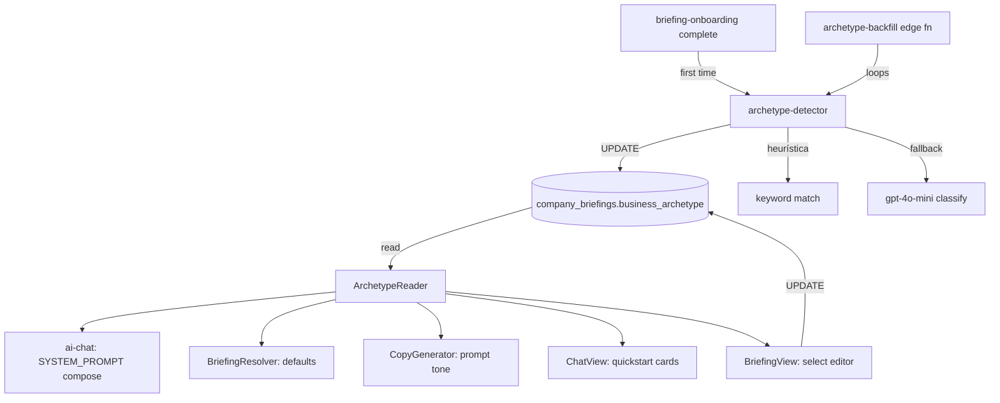
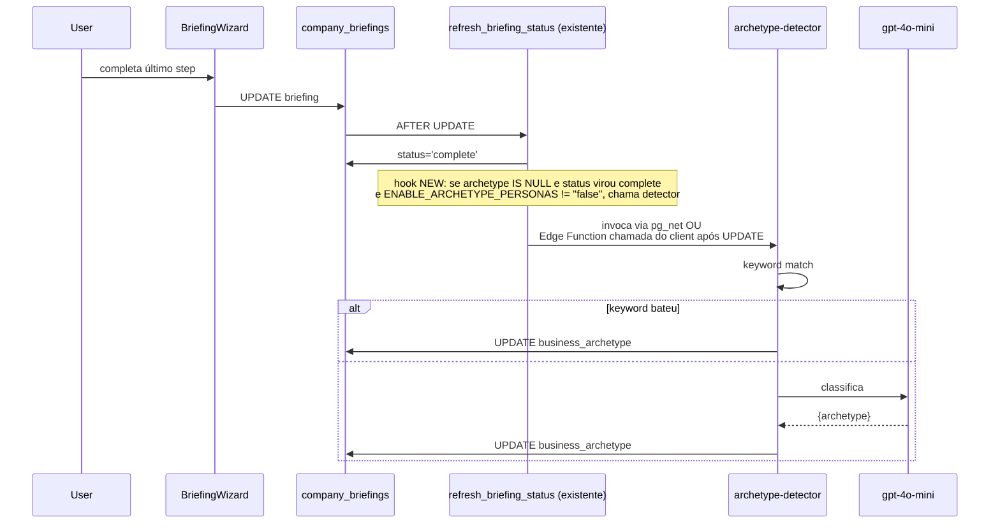
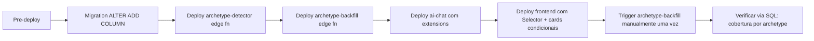

# Design Document — business-archetype-personas

## Overview

**Purpose:** Adaptar tom, atalhos e defaults do Agente HERO ao tipo de negócio do usuário (4 arquétipos), eliminando a sensação de "ferramenta genérica de marketing" e tornando a experiência relevante por persona.

**Users:** Pedro (padaria), Maria (e-commerce), João (eletricista), Ana (curso online) — e o conjunto residual sem arquétipo detectado, atendido com defaults genéricos.

**Impact:** Adiciona 1 coluna em `company_briefings`, 1 detector backend, 1 Edge Function de backfill, mapas estáticos por concern, 1 seletor no Settings, e blocos modulares de prompt. Zero mudança em comportamento de tenants existentes (NULL = Fase 1 preservada).

### Goals
- Personalização condicional sem quebrar a Fase 1 quando archetype está NULL
- Detecção automática barata e idempotente
- Edição manual fácil pelo usuário em Settings
- Adicionar 5º arquétipo no futuro = adicionar entrada em N mapas (zero novo código de orquestração)

### Non-Goals
- Detecção via crawler de website (Fase 3+)
- Wizard de onboarding redesenhado por arquétipo
- A/B test framework para comparar personalização vs genérico
- Suporte a "multi-arquétipo" (ex.: padaria que tem delivery online conta como ambos)

## Architecture

### Existing Architecture Analysis

**Reusos:**
- `company_briefings` (briefing-onboarding) — adicionar coluna, sem novo modelo
- `BriefingResolver` / `CopyGenerator` (chat-publish-flow) — estender com parâmetro arquétipo
- `SYSTEM_PROMPT` em `_shared/prompt.ts` — composição via append condicional (padrão existente nas linhas 322 e 362 do ai-chat/index.ts)
- `BriefingView` — adicionar seção de arquétipo
- `useBriefing` hook — estender com mutation para `business_archetype`
- ChatView quickstart cards — substituir array literal por map estático

**Boundaries respeitados:**
- Fase 1 sem regressão garantida via fallback NULL
- Mudança aditiva no DB (ALTER ADD COLUMN sem default → permitiu NULL)
- Edge Functions backend lêem archetype via DB; nada em-memória/cache

### Architecture Pattern & Boundary Map

**Pattern:** Conditional configuration via static maps (Strategy "lite") + persistente em DB.



**Decisões de boundary:**
- `ArchetypeReader` é puramente uma função de leitura (`readArchetype(supabase, companyId): Promise<Archetype | null>`); não cacheia
- `archetype-detector` é puro lógica + opcional fetch OpenAI; sem state
- Frontend renderiza condicionalmente; sem requisição extra (arquétipo já vem na query do briefing)

### Technology Stack

| Layer | Choice / Version | Role | Notes |
|-------|------------------|------|-------|
| Frontend | React 18 + TanStack Query v5 + shadcn/ui Select | Seletor em Settings + cards condicionais | Reusa hook `useBriefing` |
| Backend orchestrator | Supabase Edge Function (Deno) + OpenAI gpt-4o | Lê archetype + injeta bloco condicional no SYSTEM_PROMPT | Append, não substituição |
| Backend detector | Edge Function (one-shot) + gpt-4o-mini opcional | Classificação keyword + LLM fallback | Modelo barato; fallback se key ausente é NULL |
| Backend shared | TypeScript modules `_shared/archetype-*.ts` | Mapas, detector puro, system prompt blocks | Reusados por handlers e edge fns |
| Data | Postgres (Supabase) — ALTER `company_briefings` ADD COLUMN | Persistência | NULL = sem arquétipo |
| Feature flag | env `ENABLE_ARCHETYPE_PERSONAS` (default ON) | Kill switch | Default unset = ON; setar `"false"` desliga |

## System Flows

### Flow A — Detecção automática no fim do briefing-onboarding



> Decisão: NÃO usar postgres trigger pra disparar Edge Function (pg_net configurado em poucos casos no projeto). Em vez disso, **chamar `archetype-detector` do FRONTEND** após `BriefingWizard` finalizar, paralelo à navegação. Mais simples, menos cross-system.

### Flow B — Composição do system prompt em cada chamada do chat

```mermaid
flowchart LR
    A[ai-chat: request received] --> B[load companyId]
    B --> C[ArchetypeReader.read]
    C --> D{archetype?}
    D -->|null| E[SYSTEM_PROMPT base]
    D -->|set| F[SYSTEM_PROMPT base + ARCHETYPE_BLOCKS&#91;archetype&#93;]
    E --> G[OpenAI call]
    F --> G
```



## Requirements Traceability

| Requirement | Summary | Components | Interfaces | Flows |
|---|---|---|---|---|
| 1.1, 1.5 | Coluna business_archetype + migration aditiva | Migration | DDL | — |
| 1.2, 1.3 | NULL permitido / fallback | ArchetypeReader, BriefingResolver, todos consumidores | `readArchetype` | Flow B |
| 2.1, 2.4, 2.5, 2.6 | Detector trigger + idempotência + fallback | `archetype-detector` Edge Function, BriefingWizard `onFinish` | `detectArchetype()` | Flow A |
| 2.2 | Heurística keyword | `_shared/archetype-detector.ts` (`matchByKeyword`) | function | Flow A |
| 2.3 | LLM fallback | mesmo arquivo (`classifyViaLLM`) | function | Flow A |
| 3.1, 3.2, 3.3, 3.4 | Settings UI seletor | `ArchetypeSelector` (novo componente em BriefingView) | useBriefing.updateArchetype | — |
| 4.1, 4.6, 4.7 | System prompt v3 com bloco condicional | ai-chat/index.ts (montagem) + `_shared/prompt-archetype-blocks.ts` | string append | Flow B |
| 4.2-4.5 | Conteúdo dos 4 blocos | `_shared/prompt-archetype-blocks.ts` (constantes) | strings | Flow B |
| 5.1, 5.6, 5.7 | Quickstart cards condicionais | `ChatView` + `_shared/quickstart-cards.ts` | render | — |
| 5.2-5.5 | Conteúdo dos 4 conjuntos | mesmo arquivo (constantes) | data | — |
| 6.1, 6.7, 6.8 | BriefingResolver condicional | `_shared/campaign-proposal-helpers.ts` (estendido) | resolveDefaults({archetype}) | Flow B implícito |
| 6.2-6.5 | Mapas por concern | constantes em campaign-proposal-helpers | maps | — |
| 6.6 | CopyGenerator condicional | mesmo arquivo (`generateCopy({archetype})`) | function | — |
| 7.1, 7.2 | Backfill | `archetype-backfill` Edge Function | one-shot | — |
| 7.3 | Cobertura query | View opcional ou query manual | SQL | — |
| 8.1, 8.2 | Telemetria por arquétipo | metadata em agent_runs | jsonb | — |
| 8.3, 8.4 | Fallback robusto + flag | env `ENABLE_ARCHETYPE_PERSONAS`, NULL handling | env | Flow A/B |

## Components and Interfaces

| Component | Domain/Layer | Intent | Req | Dependencies | Contracts |
|---|---|---|---|---|---|
| Migration `add_business_archetype` | Data | ALTER ADD COLUMN aditiva | 1 | companies (P0) | DDL |
| `ArchetypeReader` | Backend shared | Lê archetype do tenant | 1.3, 4.7 | DB(P0) | Service |
| `archetype-detector` (module + edge fn) | Backend | Classificação heurística + LLM | 2 | OpenAI(P1), DB(P0) | Service + Batch |
| `archetype-backfill` (edge fn) | Backend | One-shot dos retroativos | 7 | archetype-detector(P0) | Batch |
| `prompt-archetype-blocks.ts` | Backend shared | 4 strings constantes | 4 | — | State (constants) |
| `quickstart-cards.ts` | Frontend shared | Mapa de cards por archetype | 5 | — | State (constants) |
| `ArchetypeSelector` | Frontend UI | Select em BriefingView | 3 | useBriefing(P0) | UI |
| `useBriefing.updateArchetype` | Frontend hook | Mutation pra setar arquétipo | 3.3 | DB(P0) | State |
| Extensão `BriefingResolver` | Backend shared | Defaults condicionais | 6.1-6.5, 6.7, 6.8 | ArchetypeReader(P0) | Service |
| Extensão `CopyGenerator` | Backend shared | System prompt condicional | 6.6 | OpenAI(P0) | Service |
| Extensão `ai-chat orchestrator` | Backend | Append do bloco no SYSTEM_PROMPT | 4.1, 4.7 | ArchetypeReader(P0) | Service |

### Backend — shared modules

#### ArchetypeReader

| Field | Detail |
|---|---|
| Intent | Função pura de leitura do `business_archetype` do tenant. |
| Requirements | 1.3, 4.7 |

**Contracts:** Service ✅

```typescript
export type Archetype = 'small_local_business' | 'online_seller' | 'service_provider' | 'info_product';

export async function readArchetype(
  supabase: SupabaseClient,
  companyId: string,
): Promise<Archetype | null>;
```

- Preconditions: companyId válido
- Postconditions: retorna o valor da coluna ou null; nunca lança
- Invariants: NÃO cacheia (mudança em Settings deve refletir imediato)

**Implementation Notes:**
- Integration: chamada por ai-chat na entrada do request, BriefingResolver em resolveDefaults, CopyGenerator se archetype não vier no input
- Validation: garante que valor lido está no enum; se inválido (corrupção), retorna null + log warning
- Risks: query extra por request — mitigar com staleTime curto na query principal de briefing (já existe)

#### archetype-detector (módulo + edge fn)

| Field | Detail |
|---|---|
| Intent | Classifica negócio em 1 dos 4 arquétipos a partir de niche/short_description; idempotente; opcional LLM. |
| Requirements | 2.1-2.6, 7.1, 7.2 |

**Contracts:** Service ✅ + Batch ✅

```typescript
export interface DetectorInput {
  niche: string | null;
  niche_category: string | null;
  short_description: string | null;
  primary_offer_format?: 'course' | 'service' | 'physical' | 'saas' | 'other';
}

export type DetectionResult =
  | { archetype: Archetype; method: 'keyword' | 'llm'; confidence: number }
  | { archetype: null; method: 'failed'; reason: string };

export async function detectArchetype(input: DetectorInput): Promise<DetectionResult>;
```

**Heurística (R2.2):** ordem de tentativa = primary_offer_format → niche → niche_category → short_description.

**LLM fallback (R2.3):**
- Modelo: `gpt-4o-mini`
- Max tokens: 50
- Response format: `json_object`
- Timeout: 8s; em falha → `{ archetype: null, method: 'failed', reason: 'llm_timeout' }`

**Edge Function `archetype-detector`:**
- Endpoint: `POST /functions/v1/archetype-detector` (verify_jwt = false; chamada do FE com user JWT)
- Body: `{ company_id }`
- Response: 200 + DetectionResult (e UPDATE em DB se não-null)
- Idempotente (R2.5): se `business_archetype IS NOT NULL`, retorna `{ archetype: <existente>, method: 'skipped' }` sem chamar LLM

**Implementation Notes:**
- Integration: chamado por (1) BriefingWizard `onFinish` quando completa briefing pela primeira vez; (2) `archetype-backfill` em loop
- Validation: defesa contra niche vazio/null em todos os campos → retorna failed
- Risks: ambiguidade lexical (ex.: "loja de roupa" pode ser local ou online) — heurística desempata pelo `primary_offer_format` antes; LLM como tiebreaker

#### archetype-backfill (edge fn)

| Field | Detail |
|---|---|
| Intent | One-shot para classificar briefings completos pré-existentes sem arquétipo. |
| Requirements | 7.1, 7.2 |

**Contracts:** Batch ✅

- Trigger: chamada manual via `curl` ou agendada via `pg_cron` uma vez
- Input: opcional `{ batch_size?: number; max_total?: number }` (default 10 e 1000)
- Output: log em `agent_runs` com `agent_name='archetype-backfill'` registrando total processado, classificados, falhados
- Idempotency: skipa rows com archetype já setado

**Implementation Notes:**
- Loop: SELECT briefings WHERE status='complete' AND business_archetype IS NULL ORDER BY created_at LIMIT batch_size
- Para cada: invocar `detectArchetype()` síncrono
- Sleep 6s entre lotes (10 calls/min de OpenAI conservadoramente)
- Critério de parada: nenhum row pendente OU max_total alcançado

### Backend — extensões

#### Extensão `BriefingResolver`

```typescript
// Antes (Fase 1):
function resolveDefaults(supabase, companyId, overrides): Promise<{ ok, defaults } | { ok:false, error_kind }>;

// Depois (Fase 2):
function resolveDefaults(
  supabase: SupabaseClient,
  companyId: string,
  overrides: Overrides,
  // novo argumento opcional; quando ausente, lê via ArchetypeReader
  archetype?: Archetype | null,
): Promise<{ ok, defaults } | { ok:false, error_kind }>;
```

**Mapas adicionados** (no mesmo arquivo `campaign-proposal-helpers.ts`):

```typescript
const OBJECTIVE_BY_ARCHETYPE: Partial<Record<Archetype, CampaignObjective>> = {
  small_local_business: 'TRAFFIC',
  online_seller: 'SALES',
  service_provider: 'LEADS',
  info_product: 'LEADS',
};

const CTA_BY_ARCHETYPE: Partial<Record<Archetype, MetaCtaEnum>> = {
  small_local_business: 'LEARN_MORE',
  online_seller: 'SHOP_NOW',
  service_provider: 'CONTACT_US',
  info_product: 'SIGN_UP',
};
```

**Precedência:** `overrides.objective` > `OBJECTIVE_BY_ARCHETYPE[archetype]` > `OBJECTIVE_BY_FORMAT[offer.format]` (mantido como fallback).

#### Extensão `CopyGenerator`

```typescript
function generateCopy(input: {
  defaults: ResolvedDefaults;
  overrides?: { ... };
  archetype?: Archetype | null;  // novo
}): Promise<CopyPayload>;
```

System prompt do gpt-4o ganha bloco condicional: se archetype está setado, inclui linha extra `Tom para arquetipo X: <hint específica>` (ex.: "para small_local_business: mencione bairro/cidade quando souber, evite jargão de funil").

#### Extensão `ai-chat orchestrator`

```typescript
// Pseudocódigo de inserção no fluxo existente
const archetype = await readArchetype(supabaseAdmin, companyId);
let systemPrompt = SYSTEM_PROMPT;
if (archetype && Deno.env.get('ENABLE_ARCHETYPE_PERSONAS') !== 'false') {
  systemPrompt += '\n\n' + ARCHETYPE_BLOCKS[archetype];
}
```

`ARCHETYPE_BLOCKS` em `_shared/prompt-archetype-blocks.ts` (novo arquivo): 4 strings de ~30 linhas cada, redigidas no PR de implementação seguindo R4.2–4.5.

### Frontend

#### ArchetypeSelector

| Field | Detail |
|---|---|
| Intent | Select em BriefingView com 5 opções (4 arquétipos + "Não sei") + descrição inline. |
| Requirements | 3.1-3.4 |

**Implementation Notes:** componente leve usando `Select` do shadcn-ui; auto-save via `useBriefing.updateArchetype`; toast de confirmação. Texto descritivo em PT leigo abaixo da opção atualmente selecionada.

#### Quickstart cards condicionais

```typescript
// _shared/quickstart-cards.ts (frontend)
export interface QuickstartCard { label: string; prompt: string; }

export const QUICKSTART_BY_ARCHETYPE: Record<Archetype | 'fallback', QuickstartCard[]> = {
  small_local_business: [...],
  online_seller: [...],
  service_provider: [...],
  info_product: [...],
  fallback: [...], // 4 atuais genéricos
};

export function getQuickstartCards(archetype: Archetype | null): QuickstartCard[] {
  if (!archetype) return QUICKSTART_BY_ARCHETYPE.fallback;
  return QUICKSTART_BY_ARCHETYPE[archetype];
}
```

ChatView lê `archetype` do hook `useBriefing` e passa pra `getQuickstartCards`.

## Data Models

### Logical Data Model

ALTER aditiva em `public.company_briefings`:

```sql
ALTER TABLE public.company_briefings
ADD COLUMN business_archetype text
  CHECK (business_archetype IS NULL OR business_archetype IN
    ('small_local_business', 'online_seller', 'service_provider', 'info_product'));
```

- Sem default: rows existentes ficam NULL.
- Sem NOT NULL: NULL é estado válido (sem arquétipo detectado / "Não sei").
- Sem índice (R1.4): consulta sempre por `company_id` PK; cardinalidade baixa.

### Data Contracts & Integration

Telemetria (R8.1, R8.2) — adiciona campo em `agent_runs.metadata`:

```jsonc
{
  "business_archetype": "small_local_business",  // ou null
  "tool": "propose_campaign"                     // já existente
}
```

Sem migration (jsonb extensível). Queries de cobertura via SQL ad-hoc:

```sql
SELECT business_archetype, COUNT(*)
FROM company_briefings
WHERE status = 'complete'
GROUP BY business_archetype;
```

## Error Handling

### Error Strategy

Toda detecção/leitura é **fail-open para NULL** — usuário sempre tem fallback à Fase 1. Erros visíveis ao usuário só no Settings (ao tentar trocar arquétipo) via toast destrutivo.

### Error Categories

| Erro | Tratamento |
|---|---|
| LLM timeout em `detectArchetype` | Retorna `{ archetype: null, method: 'failed', reason: 'llm_timeout' }`. Backfill loga e segue. Wizard segue normalmente sem bloquear. |
| LLM retorna JSON inválido | Mesmo tratamento: NULL + log |
| User troca arquétipo no Settings + falha de UPDATE | Toast vermelho com mensagem genérica, mantém valor anterior. Sem perda de dados (RLS check falhou ou perda de conexão) |
| `ENABLE_ARCHETYPE_PERSONAS=false` | Toda lógica condicional vira no-op; comportamento Fase 1 puro |
| Valor corrompido na coluna (não bate enum) | ArchetypeReader retorna null + warn |

## Testing Strategy

### Unit Tests
- `detectArchetype` — 8 fixtures (2 por arquétipo, com keywords plausíveis); validar method='keyword' resolve sem LLM
- `BriefingResolver` — 4 cenários com archetype setado verificando precedência over format
- `CopyGenerator` — verificar que prompt do gpt-4o ganha hint quando archetype passado

### Integration Tests
- E2E: completar briefing com niche="padaria" → verificar UPDATE em business_archetype='small_local_business' após 5s
- ChatView: setar archetype manualmente em DB e verificar quickstart cards corretos no welcome
- ai-chat: archetype setado vs unset → verificar diferença no system prompt enviado pro OpenAI (mock)

### Performance
- detectArchetype heurística: <10ms p99
- archetype-backfill: 1000 briefings em <12 min com lotes de 10 + 6s sleep

## Security Considerations

- **RLS:** column herda RLS de `company_briefings`; UPDATE só pelo dono
- **LLM data:** detector envia apenas `niche` + `short_description` ao OpenAI — sem PII sensível (briefing já trata isso)
- **Feature flag:** kill switch via env `ENABLE_ARCHETYPE_PERSONAS=false` (default ON)

## Migration Strategy



**Rollback:**
- DB: nada (coluna NULL não impacta nada existente). Pode `ALTER DROP COLUMN` se necessário.
- Backend: revert dos 2 edge fns; ai-chat sem extensions = comportamento Fase 1
- Frontend: revert dos componentes; cards genéricos restaurados
- Kill switch: `ENABLE_ARCHETYPE_PERSONAS=false` no env, sem revert necessário

## Supporting References

- Padrão de mapas estáticos: já usado em [campaign-proposal-helpers.ts](supabase/functions/_shared/campaign-proposal-helpers.ts) (`OBJECTIVE_BY_FORMAT`)
- Padrão de append condicional ao SYSTEM_PROMPT: ai-chat/index.ts linhas 322 e 362 (`briefingHint`, `briefingContext`)
- Padrão de Edge Function backfill one-shot: pattern usado em outras tarefas de manutenção do projeto
