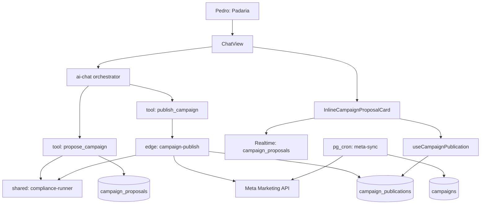
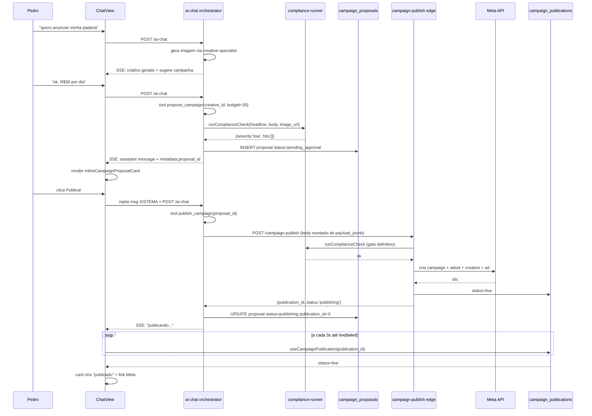
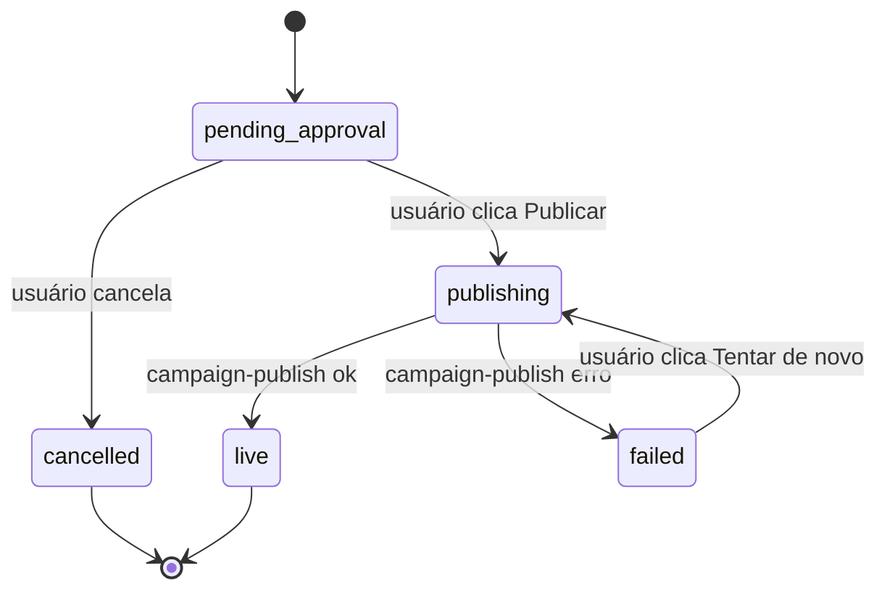
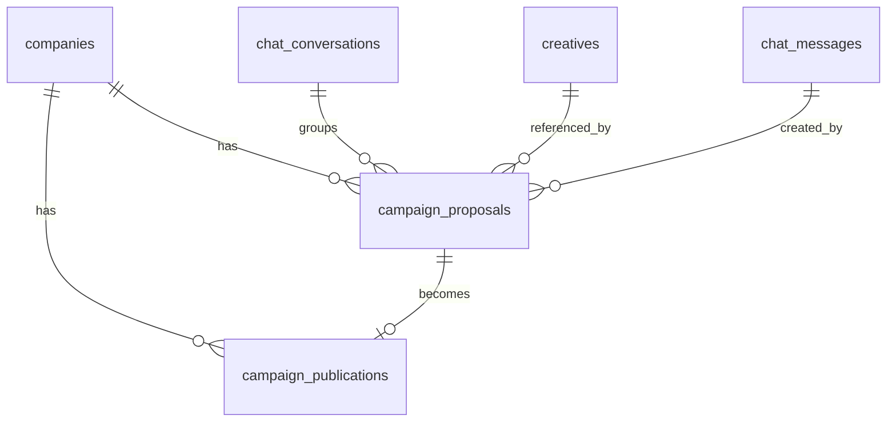
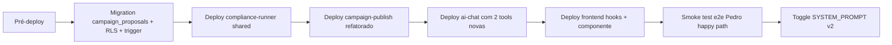

# Design Document — chat-publish-flow

## Overview

**Purpose:** Permitir que o usuário leigo conclua a publicação de uma campanha Meta Ads sem sair do chat, transformando o agente HERO de "gerador de criativo" em "co-piloto que publica de verdade".

**Users:** Donos de comércio físico/digital sem familiaridade com Meta Ads Manager (persona Pedro). Sucesso = ≤5 turns de chat entre `<creative-gallery>` e `status='live'`.

**Impact:** Adiciona 2 tools ao orchestrator (`propose_campaign`, `publish_campaign`), 1 tabela (`campaign_proposals`), 1 helper compartilhado (`_shared/compliance-runner.ts`), 1 componente UI (`InlineCampaignProposalCard` + modal de edição), e refina o system prompt do `ai-chat`. Reusa toda a infra de `campaign-publish` (Edge Function), `useCampaignPublication` (polling), e padrões de realtime de `approvals`.

### Goals
- Levar usuário de criativo gerado → campanha rodando no Meta sem sair do chat
- Pré-preencher 100% dos campos a partir de briefing/oferta/criativo (zero formulário cego)
- Pré-checar compliance antes do "Publicar" (UX preditiva)
- Telemetria completa em `agent_runs` (latência, custo, taxa de sucesso por turn)

### Non-Goals
- Persona-aware vocabulary por arquetipo de negócio (Fase 2)
- Briefings/relatórios proativos via push (Fase 3)
- Loop de auto-otimização (Fase 4)
- Múltiplos formatos por campanha (carousel, video) — só feed single-image v1
- Setting de "default Meta page/account" em Integrations (spec separada)

## Architecture

### Existing Architecture Analysis

**Reusos:**
- Padrão HITL: `approvals` table + realtime channel filtrado por `conversation_id` (use-conversation-actions.ts:50-62)
- Edge function `campaign-publish` ([campaign-publish/index.ts](supabase/functions/campaign-publish/index.ts)): rollback nativo, compliance gate, 4 níveis Meta API
- Hook `useCampaignPublication` ([use-campaign-publisher.ts]): polling state machine `validating → compliance_check → publishing → live | failed`
- Multi-agent orchestrator: ai-chat → tools síncronas + delegate_to_specialist
- Telemetria: `agent_runs` insere por agente/run

**Boundaries respeitados:**
- Tools síncronas do orchestrator não bloqueiam stream SSE >2s (campanha publica via fire-and-forget pra `campaign-publish`)
- Tenant isolation via `current_user_company_id()` em todas RLS

### Architecture Pattern & Boundary Map

**Pattern:** Conversational HITL workflow com event-sourced state. Card inline é "live view" sobre `campaign_proposals.status` + `campaign_publications.status`.



**Decisões de boundary:**
- `propose_campaign` é síncrona: monta payload, roda compliance preview, INSERT em `campaign_proposals`, retorna `proposal_id` em <8s
- `publish_campaign` é fire-and-trigger: invoca `campaign-publish`, recebe `publication_id`, retorna em <3s; UI faz polling
- Compliance lógica é fonte única (`_shared/compliance-runner.ts`) — usado por preview (propose) e gate definitivo (publish)

### Technology Stack

| Layer | Choice / Version | Role | Notes |
|-------|------------------|------|-------|
| Frontend | React 18 + TanStack Query v5 + shadcn/ui | UI do card + modal de edição + polling | Reusa hooks/padrões existentes |
| Frontend Realtime | `@supabase/supabase-js` v2 channels | Atualização do card sem F5 | Pattern já em `use-approvals.ts` |
| Backend orchestrator | Supabase Edge Function (Deno) + OpenAI gpt-4o function calling | Tools `propose_campaign` e `publish_campaign` | Adiciona 2 entradas no switch existente |
| Backend shared | TypeScript module `_shared/compliance-runner.ts` | Compliance scoring reusado | Refator de `campaign-publish` |
| Backend publish | Edge Function `campaign-publish` (existente, não alterada na lógica core) | Cria campanha real no Meta | Imports `compliance-runner` |
| Data | Postgres (Supabase) — nova tabela `campaign_proposals` | Persistência da proposta com lifecycle | RLS por `company_id` |
| External | Meta Marketing API v23.0 (já integrada) | Publicação real | Reusa `meta_ad_accounts/pages/pixels` |
| AI | OpenAI gpt-4o (orchestrator) + Claude (compliance vision já em campaign-publish) | Coleta + scoring | Sem mudança de modelo |

## System Flows

### Flow A — Da geração do criativo à publicação



### Flow B — Erro com retry



## Requirements Traceability

| Requirement | Summary | Components | Interfaces | Flows |
|---|---|---|---|---|
| 1.1–1.6 | Tool propose_campaign coleta + pré-preenche | `ProposeCampaignHandler`, `BriefingResolver`, `CopyGenerator` | `ProposeCampaignInput`/`Output` | Flow A |
| 1.7 | Persistir proposta | `CampaignProposalsRepo` | INSERT proposal | Flow A |
| 1.8, 10.1–10.3 | Gate de pré-requisitos | `TenantPrereqGuard` | `PrereqError` enum | Flow A (early return) |
| 2.1–2.6 | Card inline + edição + realtime | `InlineCampaignProposalCard`, `CampaignProposalEditor`, `useCampaignProposal` | Props + RealtimeChannel | Flow A |
| 3.1–3.7 | Tool publish_campaign | `PublishCampaignHandler`, `ProposalToCampaignMapper` | `PublishCampaignInput`/`Output` | Flow A |
| 4.1–4.4 | Polling status | `useCampaignPublication` (existente) integrado no card | Hook reuso | Flow A (loop) |
| 5.1–5.5 | System prompt v2 | `prompt.ts` SYSTEM_PROMPT | string | implícito |
| 6.1–6.5 | Schema/RLS proposta | Migration `20260501000001_campaign_proposals.sql` | DDL | — |
| 7.1–7.5 | Compliance pre-check | `complianceRunner.runCheck` (shared) | `ComplianceResult` | Flow A |
| 8.1–8.3 | Sync pós-live | (sem código novo: cron existente) + link "Ver no Painel" | navigateToView | — |
| 9.1–9.3 | Telemetria | `AgentRunsLogger` (helper existente) | `agent_runs` insert | Flow A |

## Components and Interfaces

| Component | Domain/Layer | Intent | Req | Dependencies | Contracts |
|---|---|---|---|---|---|
| `ProposeCampaignHandler` | Backend tool | Coleta+monta proposta | 1.1–1.7 | BriefingResolver(P0), ComplianceRunner(P0), CampaignProposalsRepo(P0) | Service |
| `PublishCampaignHandler` | Backend tool | Invoca campaign-publish | 3.1–3.7 | ProposalToCampaignMapper(P0), campaign-publish edge(P0) | Service |
| `TenantPrereqGuard` | Backend shared | Valida ad_account/page/briefing | 1.8, 10 | meta_ad_accounts/meta_pages tables(P0) | Service |
| `BriefingResolver` | Backend shared | Lê briefing+oferta+criativo | 1.3–1.6 | DB(P0) | Service |
| `CopyGenerator` | Backend shared | Gera headline/body/cta dentro de limites Meta | 1.6 | OpenAI gpt-4o(P0) | Service |
| `ProposalToCampaignMapper` | Backend shared | Mapeia proposal payload → Zod do campaign-publish | 3.3 | Zod schemas existentes(P0) | Service |
| `ComplianceRunner` | Backend shared | Roda compliance score (refatorado) | 7.1–7.5 | Anthropic SDK(P0), Supabase Storage(P1) | Service |
| `CampaignProposalsRepo` | Backend shared | CRUD em campaign_proposals | 1.7, 6 | Postgres(P0) | Service |
| `InlineCampaignProposalCard` | Frontend | Card visual da proposta | 2.1–2.4 | useCampaignProposal(P0), useCampaignPublication(P0) | State |
| `CampaignProposalEditor` | Frontend | Modal de edição | 2.5 | useCampaignProposal mutate(P0) | State |
| `useCampaignProposal` | Frontend hook | Fetch + realtime + mutate | 2.6 | TanStack Query(P0), Supabase realtime(P0) | State |
| `useCampaignPublication` | Frontend hook | Polling publication status (REUSADO) | 4.1–4.4 | TanStack Query(P0) | State |

### Backend — propose/publish handlers

#### ProposeCampaignHandler

| Field | Detail |
|---|---|
| Intent | Tool do orchestrator que monta proposta a partir de briefing/oferta/criativo + roda compliance preview |
| Requirements | 1.1–1.7, 7.1–7.5 |

**Responsibilities:**
- Validar `creative_id` e tenant (R1.2)
- Resolver pré-defaults: objective (R1.3), targeting (R1.4), budget (R1.5), copy (R1.6)
- Rodar compliance preview (R7) e anexar ao payload
- INSERT em `campaign_proposals` (R1.7) e logar em `agent_runs`

**Dependencies:**
- Inbound: `ai-chat` switch (executeTool) — chamada síncrona (P0)
- Outbound: `BriefingResolver`, `CopyGenerator`, `ComplianceRunner`, `CampaignProposalsRepo`, `TenantPrereqGuard` (P0)
- External: OpenAI gpt-4o (via CopyGenerator) (P0)

**Contracts:** Service ✅ / API / Event / Batch / State

```typescript
interface ProposeCampaignInput {
  creative_id: string;
  objective?: 'SALES' | 'LEADS' | 'AWARENESS' | 'TRAFFIC' | 'ENGAGEMENT';
  daily_budget_brl?: number;          // mínimo R$10
  audience_overrides?: Partial<AudiencePayload>;
  copy_overrides?: Partial<{ headline: string; body: string; cta: MetaCtaEnum }>;
}

type AudiencePayload = {
  age_min: number;       // 13-65
  age_max: number;       // 13-65
  geo_locations: { countries?: string[]; cities?: Array<{ key: string; radius?: number; distance_unit?: 'kilometer' }> };
  interests?: Array<{ id: string; name: string }>;  // v1: vazio
};

type MetaCtaEnum =
  | 'LEARN_MORE' | 'SHOP_NOW' | 'SIGN_UP' | 'CONTACT_US'
  | 'GET_OFFER' | 'BOOK_TRAVEL' | 'SUBSCRIBE' | 'WHATSAPP_MESSAGE';

type ProposeCampaignResult =
  | { ok: true; proposal_id: string; summary_md: string }
  | { ok: false; error_kind: PrereqErrorKind | 'invalid_input' | 'compliance_unavailable'; message: string };

type PrereqErrorKind =
  | 'missing_meta_connection'
  | 'missing_page_selection'
  | 'creative_not_found'
  | 'creative_not_in_tenant'
  | 'briefing_no_offer';
```

- Preconditions: tenant tem ad_account ativa; creative_id é dono do tenant; OpenAI key configurada
- Postconditions: linha em `campaign_proposals` com `status='pending_approval'` ou erro estruturado retornado ao LLM
- Invariants: NUNCA expõe IDs Meta crus no `summary_md` (apenas IDs internos do proposal)

**Implementation Notes:**
- Integration: handler vai como novo `case 'propose_campaign'` no switch de `ai-chat/index.ts:893`
- Validation: Zod no input + Zod no payload final antes do INSERT
- Risks: timeout do compliance-runner (>10s) → fail-open com `severity='unknown'`, badge cinza no card

#### PublishCampaignHandler

| Field | Detail |
|---|---|
| Intent | Aprovação humana → invoca `campaign-publish` edge → atualiza proposal |
| Requirements | 3.1–3.7 |

**Responsibilities:**
- Validar proposal_id pertence ao tenant e está `pending_approval` (R3.2)
- Mapear `payload_jsonb` → body Zod do `campaign-publish` (R3.3)
- Invocar `campaign-publish` via fetch com user JWT (R3.3)
- UPDATE proposal com `publication_id` e `status='publishing'|'failed'` (R3.4–3.6)

**Dependencies:**
- Inbound: `ai-chat` switch — chamada síncrona após mensagem `[SISTEMA]` (P0)
- Outbound: `ProposalToCampaignMapper`, `campaign-publish` edge fn (P0)
- External: HTTP fetch via `SUPABASE_URL/functions/v1/campaign-publish` (P0)

**Contracts:** Service ✅ / API / Event / Batch / State

```typescript
interface PublishCampaignInput {
  proposal_id: string;
}

type PublishCampaignResult =
  | { ok: true; publication_id: string; summary_md: string }
  | {
      ok: false;
      error_kind: 'proposal_not_found' | 'wrong_status' | 'validation' | 'compliance' | 'upstream' | 'timeout';
      message: string;
      retry_hint?: string;
    };
```

- Preconditions: proposal existe, status `pending_approval`, tenant ainda tem ad_account ativa
- Postconditions: proposal status muda; `campaign_publications` row criada por `campaign-publish`
- Invariants: imagem signed URL é regenerada com TTL fresh ANTES de mandar pra Meta (D7)

**Implementation Notes:**
- Integration: novo case no switch ai-chat
- Validation: estrutural (Zod) + de estado (status = pending_approval)
- Risks: `campaign-publish` timeout >55s → status `failed`, mas proposta volta editável

### Backend — shared modules

#### ComplianceRunner

| Field | Detail |
|---|---|
| Intent | Lógica de scoring de compliance (Anthropic Vision + análise textual) extraída de `campaign-publish` |
| Requirements | 7.1–7.5 |

**Contracts:** Service ✅

```typescript
interface ComplianceCheckInput {
  company_id: string;
  copy: { headline: string; body: string; description?: string };
  image_url?: string;            // signed URL Supabase ou pública
  context?: 'preview' | 'gate';  // preview pode ter timeout menor
}

type ComplianceSeverity = 'none' | 'low' | 'medium' | 'high' | 'unknown';

interface ComplianceCheckResult {
  severity: ComplianceSeverity;
  score: number;          // 0-100
  hits: Array<{ kind: 'word' | 'visual' | 'topic'; text: string; severity: ComplianceSeverity }>;
  blocking: boolean;      // true se severity=high E context=gate
  duration_ms: number;
}
```

- Preconditions: copy ≠ vazio; image_url se passada precisa retornar 200 dentro de 8s
- Postconditions: NÃO grava nada (puro); caller decide o que persistir
- Invariants: `context='preview'` tem timeout interno 10s; `context='gate'` tem 30s

**Implementation Notes:**
- Integration: `campaign-publish/index.ts` passa a importar daqui (refator interno transparente)
- Validation: testes unitários comparando output antes/depois do refator (snapshot test)
- Risks: divergência sutil entre comportamento antigo/novo — mitigado por testes

#### TenantPrereqGuard

```typescript
interface PrereqContext {
  ad_account?: { id: string; account_id: string; name: string };
  page?: { id: string; page_id: string; name: string };
  pixel?: { id: string; pixel_id: string };
  briefing_complete: boolean;
}

interface PrereqGuardResult {
  ready: boolean;
  context: PrereqContext;
  missing: PrereqErrorKind[];
}

function checkPrereqs(supabase: SupabaseClient, companyId: string): Promise<PrereqGuardResult>;
```

- Heurística (D3): primeiro `meta_ad_accounts` ativo + primeiro `meta_pages` ativo da mesma página associada à conta. Se >1 página ativa, retorna `missing: []` mas marca `pages_ambiguous: true` no metadata pro handler perguntar no chat.

#### ProposalToCampaignMapper

```typescript
function mapProposalToCampaignPublishBody(
  proposal: CampaignProposal,
  prereq: PrereqContext,
): CampaignPublishBody;  // schema existente em campaign-publish/index.ts
```

- Pure function, fácil de testar
- Falha se proposal.payload_jsonb não tiver formato esperado (deixa Zod do campaign-publish capturar)

### Frontend

#### InlineCampaignProposalCard

| Field | Detail |
|---|---|
| Intent | Renderiza proposta no chat com thumbnail, copy, público, budget, badge compliance, ações |
| Requirements | 2.1–2.6, 4.1–4.4, 7.2–7.4 |

**Responsibilities:**
- Mostrar resumo legível (não jargão Meta)
- 3 ações: Publicar / Editar / Cancelar
- Após publicar: virar live view sobre `campaign_publications`

**Dependencies:**
- Inbound: `ChatView` renderiza após mensagem com `metadata.proposal_id`
- Outbound: `useCampaignProposal` (P0), `useCampaignPublication` (P0 quando status=publishing)
- External: signed URL helper para thumbnail

**Contracts:** State ✅

**Implementation Notes:** Componente "controlled" pelo hook. Realtime do hook redesenha automaticamente quando `campaign_proposals` muda. Polling de `campaign_publications` ativa só quando `proposal.status=publishing`.

#### CampaignProposalEditor

| Field | Detail |
|---|---|
| Intent | Modal Dialog com form (RHF+Zod) pra editar campos da proposta |
| Requirements | 2.5 |

Reusa pattern de `RuleEditModal` ([fury/RuleProposalCard.tsx:143](src/components/fury/RuleProposalCard.tsx#L143)). Campos: budget diário, age range, geo (cidade+raio km), headline (40), body (125), cta (select).

#### useCampaignProposal

```typescript
function useCampaignProposal(proposalId: string): {
  data: CampaignProposal | undefined;
  isLoading: boolean;
  cancel: () => Promise<Result<void, BriefingError>>;
  edit: (patch: Partial<CampaignProposalPayload>) => Promise<Result<void, BriefingError>>;
};
```

- Fetch via `select` em `campaign_proposals` filtrado por id
- Realtime channel `campaign-proposal-${id}` listening UPDATE
- staleTime 30s + invalidate em mutations

## Data Models

### Domain Model



### Logical Data Model

**`campaign_proposals`** — proposta de campanha em rascunho/lifecycle pré-publicação

| Coluna | Tipo | Notas |
|---|---|---|
| `id` | uuid PK | gen_random_uuid() |
| `company_id` | uuid NOT NULL FK companies | RLS scope |
| `conversation_id` | uuid NOT NULL FK chat_conversations | scoping por conversa |
| `creative_id` | uuid NOT NULL FK creatives | imagem usada |
| `created_by_message_id` | uuid FK chat_messages | mensagem do agente que criou |
| `payload_jsonb` | jsonb NOT NULL | full proposal (objective, budget, audience, copy, prereq snapshot) |
| `compliance_jsonb` | jsonb NOT NULL DEFAULT `'{}'` | severity, hits, score, duration_ms (preview) |
| `status` | text NOT NULL CHECK in (`pending_approval`,`cancelled`,`publishing`,`live`,`failed`) | lifecycle |
| `publication_id` | uuid FK campaign_publications NULL | populado em publish_campaign |
| `error_payload` | jsonb NULL | causa do `failed` |
| `created_at` | timestamptz DEFAULT now() | |
| `updated_at` | timestamptz DEFAULT now() | trigger `touch_*` |
| `expires_at` | timestamptz DEFAULT now()+interval '24h' | proposta vira `cancelled` automaticamente após expiry (cron) |

**Indexes:**
- `(company_id, created_at DESC)` para listagens
- `(conversation_id, status)` para realtime filtros
- `(status) WHERE status='pending_approval'` partial pra cron de expiração

**RLS:**
- SELECT/UPDATE: `company_id = current_user_company_id()`
- INSERT: somente service-role (Edge Function via `propose_campaign`)
- DELETE: bloqueado (audit trail; cleanup via cron)

**Trigger:** `touch_campaign_proposals_updated_at` (BEFORE UPDATE)

### Data Contracts & Integration

#### `payload_jsonb` shape

```typescript
interface CampaignProposalPayload {
  // Campaign level
  objective: 'SALES' | 'LEADS' | 'AWARENESS' | 'TRAFFIC' | 'ENGAGEMENT';
  campaign_name: string;     // gerado: "{offer_name} - {YYYY-MM-DD}"
  // Adset level
  daily_budget_brl: number;  // ≥10
  start_time?: string;       // ISO 8601, default: now+5min
  stop_time?: string;        // ISO 8601, default: undefined (open ended)
  audience: AudiencePayload;
  optimization_goal: 'OFFSITE_CONVERSIONS' | 'LINK_CLICKS' | 'POST_ENGAGEMENT' | 'REACH';
  // Ad level
  copy: { headline: string; body: string; description?: string; cta: MetaCtaEnum };
  link_url: string;          // do oferta.sales_url ou da página da empresa
  // Snapshots de prereq pra audit
  ad_account_snapshot: { id: string; account_id: string };
  page_snapshot: { id: string; page_id: string };
  pixel_snapshot?: { id: string; pixel_id: string };
  creative_snapshot: { id: string; media_url_at_propose: string; format: string };
}
```

#### Realtime channel naming

- `campaign-proposal-${proposal_id}` — single-subject channel; filtros `id=eq.${id}`
- Reusa pattern de [use-conversation-actions.ts:50-62](src/hooks/use-conversation-actions.ts#L50-L62)

## Error Handling

### Error Strategy

Erros são **estruturados** via discriminated union (`error_kind`) e devolvidos pelo handler como string formatada pro LLM repassar ao usuário com naturalidade. Nunca expomos stack trace cru ao usuário.

### Error Categories

| Kind | Causa | Resposta ao usuário (via LLM) |
|---|---|---|
| `missing_meta_connection` | Sem ad_platform_connections ativa | "Você precisa conectar sua conta Meta primeiro. Posso te levar lá?" + link |
| `missing_page_selection` | Conta conectada mas sem página | "Tem mais de uma página possível. Qual você quer usar?" lista nomes |
| `creative_not_found` | creative_id inválido | "O criativo que tentei usar não está mais disponível. Vou gerar outro?" |
| `briefing_no_offer` | Sem oferta principal cadastrada | "Vou precisar saber o que você vende. Me conta?" |
| `validation` (4xx do publish) | payload inválido pra Meta | mensagem LITERAL do `campaign-publish` |
| `compliance` (4xx do publish) | bloqueado por compliance gate | lista hits + sugere editar |
| `upstream` (5xx Meta) | erro temporário Meta | "Houve um erro temporário no Meta, posso tentar de novo agora?" + botão |
| `timeout` | >55s no campaign-publish | mesma de upstream |
| `compliance_unavailable` | preview falhou | proposta segue com badge cinza; permite publicar (gate definitivo no publish) |

### Monitoring

- `agent_runs.error_kind` para taxa de falha por categoria
- `campaign_proposals.status='failed'` count em dashboard interno
- Alertas (futuros) quando `error_kind='upstream'` >X% em 1h

## Testing Strategy

### Unit Tests
- `ComplianceRunner.runCheck` — snapshot test antes/depois do refator (5 cenários: ok, low, medium, high, timeout)
- `ProposalToCampaignMapper` — mapeamento payload→Zod com 3 variações (sem stop_time, com pixel, com cidade/raio)
- `BriefingResolver.resolveDefaults` — pré-preenchimento por format de oferta (course/service/physical)
- `TenantPrereqGuard.checkPrereqs` — 4 estados (ok, missing_account, missing_page, ambiguous)

### Integration Tests
- `propose_campaign` end-to-end (com DB stub) — criar proposta com pré-defaults completos
- `publish_campaign` invocando `campaign-publish` mockado — sucesso + 4xx + 5xx + timeout
- Realtime channel `campaign-proposal-${id}` recebe UPDATE quando status muda

### E2E (Playwright)
- Fluxo completo: gerar criativo → agente propõe → user clica Publicar → ver "publicando" → mock retorna `live` → card mostra "publicado" + link
- Fluxo de erro: compliance bloqueia → user edita copy → publica → ok
- Fluxo de cancelamento: user clica Cancelar → card vira disabled

### Performance
- `propose_campaign` p95 <8s (inclui compliance preview)
- `publish_campaign` p95 <3s (apenas dispara fire-and-forget)
- Polling impact: ≤1 request/3s por usuário ativo no card

## Security Considerations

- **Tenant isolation:** RLS por `company_id` em `campaign_proposals` (SELECT/UPDATE). INSERT só service-role.
- **Auth:** `propose_campaign` valida JWT do user; `publish_campaign` repassa JWT do user pro `campaign-publish` (não service-role) — mantém audit trail correto.
- **Compliance bypass:** UI mostra badge cinza quando preview falha mas NÃO desabilita o botão Publicar — gate definitivo no `campaign-publish` continua intransponível.
- **Image URL exposure:** signed URLs Supabase têm TTL ≥15min; após `live`, URL fica armazenada em `creative.media_url` (não regenerada).
- **Rate limit:** `propose_campaign` herda do orchestrator (ai-chat já tem). `publish_campaign` herda de `campaign-publish` (Meta API rate limit já tratado lá).

## Migration Strategy

Migration única, aditiva:



**Rollback:**
- Frontend: revert deploy (componente é aditivo, não quebra chat existente)
- Backend: ai-chat sem tools novas continua funcionando; campaign-publish refatorado é internal-only
- DB: tabela aditiva — sem rollback necessário; cleanup opcional via DROP

**Validation checkpoints:**
- Pós-D: rodar `campaign-publish` em ambiente de staging com payload conhecido — comparar output antigo vs novo
- Pós-E: chamar `propose_campaign` via curl com input mínimo — validar INSERT
- Pós-G: 1 publicação real em conta Meta de teste

## Supporting References

- Schema completo de `campaign-publish` body: [campaign-publish/index.ts:22-61](supabase/functions/campaign-publish/index.ts#L22-L61)
- Padrão de InlineApprovalCard como template visual: [InlineApprovalCard.tsx:1-198](src/components/chat/InlineApprovalCard.tsx)
- Hook polling reusado: `useCampaignPublication` em `src/hooks/use-campaign-publisher.ts`
- Realtime pattern: [use-conversation-actions.ts:50-62](src/hooks/use-conversation-actions.ts#L50-L62)
- Telemetria `agent_runs`: [migrations/20260424000004_agent_runs.sql](supabase/migrations/20260424000004_agent_runs.sql)
- Meta CTA enum oficial: Meta Marketing API v23.0 (action_type valores válidos)
